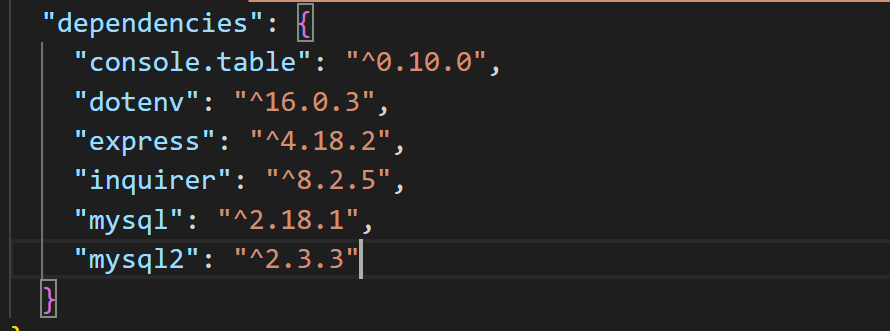

# SQL-Employee-Tracker

  
  
## User Story
As a business owner
I want to be able to view and manage the departments, roles, and employees in my company
So that I can organize and plan my business

  ## Table of Contents
  * [Description](#description)
  * [Usage](#usefaq)
  * [Installation](#install)
  * [Run](#run)
  * [Technology Used](#techno)
  * [Testing](#test)
  * [License](#license)
  * [Contributing to this Repo](#contributing)
  * [Questions / Contact Details](#questions)
  
  
  ## Description
  This is a Content Management System (CMS)  that allows non-developers to easily view and interact with information stored in a database.  It is run through a command line application.

  
  ## Usage
  Uses npm i inqirer, 
  * npm init to create a json file, 
  * npm i mysql to connect to SQL database, 
  * npm i console.table to format tables in the console

  
  ## Installation
  npm i - to install all files and dependencies

  
  ## Run
  node index.js

  
  ## Dependencies
  
    "console.table": "^0.10.0",
    "dotenv": "^16.0.3",
    "express": "^4.18.2",
    "inquirer": "^8.2.5",
    "mysql": "^2.18.1",
    "mysql2": "^2.3.3"

    
  
  ## Technologies Used
  * Javascript
  * Node.js
  * MYSQL  

  
  ## Testing
  n/a

  
  ## License
  The application is covered under a MIT license.

  
  ## Contributing to this Repo
  Please email me if you'd like to contribute

  
  ## Questions / Contact Details
  This app can be found on my github page at (https://github.com/Sara-Mill).
  Sara-Mill

  If you have any questions or need to contact me about this app, I can be reached on Github or by email at [smilligan0183@gmail.com](smilligan0183@gmail.com)